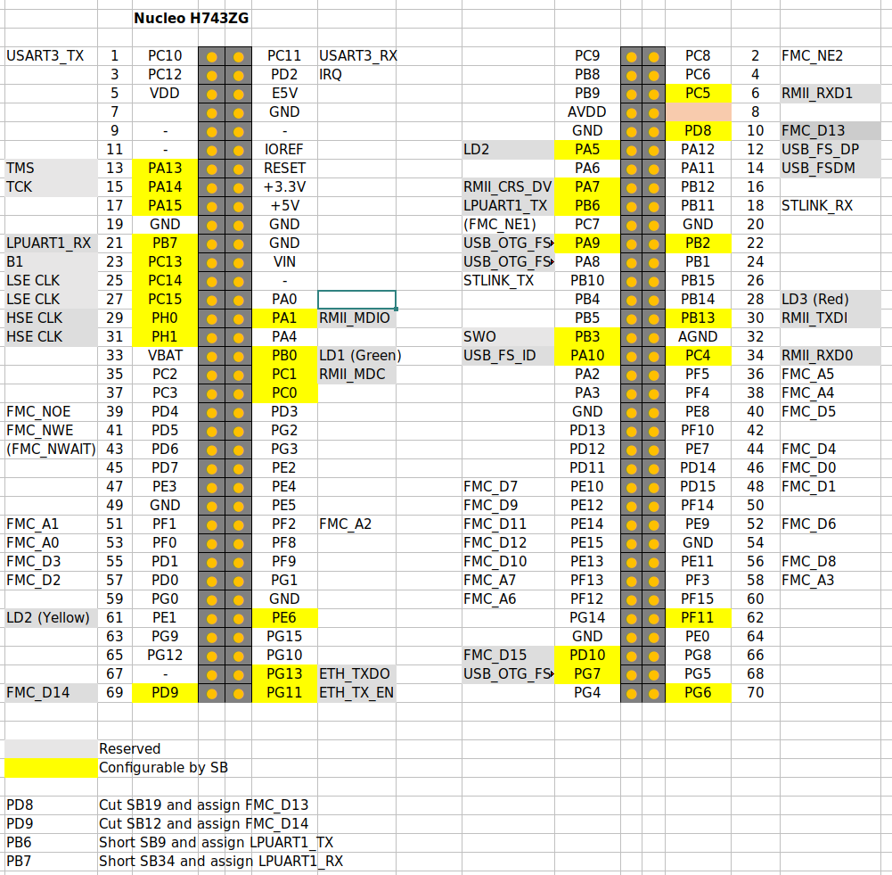

# Akashi-14
Compatct Flash board for Nucleo H735ZI.

# Details

This board connects the compact flash to the NucleoH735ZI FMC as the 8bit true IDE mode. The connection is depicted below :

| Compact Flash | H735ZI Pin | H735ZI Functionality |
|---------------|------------|----------------------|
| nCS0          | PC8        | FMC_NE2              |
| IORD          | PD4        | FMC_NOE              |
| IOWR          | PD5        | FMC_NWE              |
| nWAIT         | PD6        | FMC_NWAIT            |
| IRQ           | PD2        | EXTI2 ( active H)    |

# STM32H735ZI configuration
The followings are the pin configuration of Nucleo board. 

The CF interface of the STM32H735ZI must be configured as : 
- One of the FMC SRAM memory space must be assigned to the NE2. The CF is assigned to this memory space.
- That memory space must be 8bt and must have asynchronous wait. 
- If the IRQ is needed, assign PD2 as EXTI2. This is active H signal. 

lso, short bridge have to be configured as the followings : 

- PD8 : Cut SB12 to disconnect the STLINK VCOMM signal. 
- PD9 : Cut SB19 to disconnect the STLINK VCOMM signal. 
- PB6 : Short SB9 to assign LPUART1_TX to STLINK VCOMM signal.
- PB7 : Short SB34 to assign LPUART1_TX to STLINK VCOMM signal.

The USART3 is connected to STLINK VCOMM through the PD8 and PD9 by default. 
These pins are re-assigned to FMC. Thus, the LPUART1 have to be connected
to the STLINK VCOMM through the PB6 and PB7. 

# License
This project is licensed under [MIT License](LICENSE).